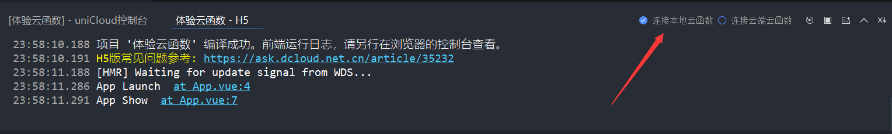

# uniCloud

uniCloud是由DCloud联合阿里云，腾讯云推出的，基于serverless的、跨全端、用js开发服务器的云产品

- 免运维，更省心
- 服务器成本更低
- 轻松上手，上手快
- 开发效率加倍提升

## 登录web控制台

https://unicloud.dcloud.net.cn/注册登录，创建一个服务空间


## 关联云服务

### 创建使用uniCloud的项目

文件>新建>项目>勾选启动uniCloud>选择腾讯云或阿里云

### 已有项目添加uniCloud

右击项目>创建云开发环境>选择腾讯云或阿里云

现在项目拥有一个`uniCloud`文件夹，右击该文件夹`关联云服务空间或项目`，选择相应的服务空间

`uniCloud`文件夹下有两个文件夹

- `cloudfunctions`
- `database`

右击`cloudfunctions`,新建云函数/云对象

例如，新建`col`云对象，该云对象文件夹下的`index.obj.js`中，添加代码如下

```js
module.exports = {
  sayHello() {
    return {
      data: "hello"
    }
  }
}
```

前端页面中调用`col`云对象

```vue
<template>
  <view class="content">
    <button @click="callco">请求服务器</button>
  </view>
</template>

<script>
  export default {
    methods: {
      async callco() {
        const co1 = uniCloud.importObject("col")
        let res = await co1.sayHello()
        // 快捷键ualert，弹框显示结果：{ data: "hello" }
        uni.showModal({
          content: JSON.stringify(res),
          showCancel: false
        })
      }
    }
  }
</script>
```

## 客户端向服务端传递参数

云函数`index.obj.js`

```js
module.exports = {
  sayHello(text) {
    return {
      code: 0,
      data: text
    }
  }
}
```

前端页面中调用云对象

```vue
<template>
  <view class="content">
    <button @click="callco">请求服务器</button>
  </view>
</template>

<script>
  export default {
    methods: {
      async callco() {
        const co1 = uniCloud.importObject("col")
        let res = await co1.sayHello("hello world")
        // 快捷键ualert
        uni.showModal({
          content: JSON.stringify(res),
          showCancel: false
        })
        // 弹框显示：{ code: 0, data: "hello world" }
      }
    }
  }
</script>
```

## 连接云端云函数

上方示例是连接本地项目中云函数



连接本地项目中云函数只用于`开发时使用`，方便快速开发调试，打包上线则必须使用云端云函数

### 上传云函数至云端

#### 上传单个云对象

右击该云对象文件夹，选择`上传部署`

#### 上传所有云对象

右击`cloudfunctions`文件夹，选择`上传所有云函数、公共模块及actions`

上传成功后则可以正常使用云端云函数了

## 操作数据库

web控制台新建数据表

1. 云数据库>创建数据表
2. 添加记录，json格式数据
3. 表结构设置`permission`,控制增删改查权限

### 设置数据库操作权限

修改database/contacts.schema.json中`permission`字段，对应`查增改删`

```json
{
  "bsonType": "object",
  "required": [],
  "permission": {
    "read": true,
    "create": true,
    "update": true,
    "delete": true
  },
  "properties": {
    "_id": {
      "description": "ID，系统自动生成"
    }
  }
}

```

### 查询数据

列表页面，使用`unicloud-db`组件，`data`即是`contacts`表的数据

```vue
<unicloud-db v-slot:default="{data, loading, error, options}" collection="contacts">
      <view v-if="error">{{error.message}}</view>
      <view v-else>
        {{data}}
      </view>
    </unicloud-db>
```

### 删除数据

列表页面，调用`unicloud-db`组件实例的`remove`方法

```js
<template>
  <view class="content">
    <unicloud-db ref="udb" v-slot:default="{data, loading, error, options}" collection="contacts">
      <view v-if="error">{{error.message}}</view>
      <view v-else>
        <uni-list>
          <uni-list-item v-for="item in data" :key="item._id" :title="item.name" :note="item.phone" link
            @longpress.native="rmItem(item._id)">
          </uni-list-item>
        </uni-list>
      </view>
    </unicloud-db>
  </view>
</template>

<script>
  export default {
    methods: {
      rmItem(id) {
        this.$refs.udb.remove(id)
      }
    }
  }
</script>
```

### 新增数据

新增页面

```js
<template>
  <view>
    <uni-easyinput v-model="item.name" placeholder="name" />
    <uni-easyinput v-model="item.phone" placeholder="phone" />
    <button type="primary" @click="submit">提交</button>
  </view>
</template>

<script>
export default {
  data() {
    return {
      item: {
        phone: '',
        name: ''
      }
    }
  },
  methods: {
    submit() {
      const db = uniCloud.database()
      db.collection('contacts')
        .add(this.item)
        .then(e => {
          console.log(e)
        })
    }
  }
}
</script>
```

修改database/contacts.schema.json中`properties`属性，增加提交的字段，不然会报错：`数据库验证失败：提交的字段在本地数据表的schema文件中不存在`

```js
{
  "bsonType": "object",
  "required": [],
  "permission": {
    "read": true,
    "create": true,
    "update": true,
    "delete": true
  },
  "properties": {
    "_id": {
      "description": "ID，系统自动生成"
    },
    "name": {},
    "phone": {}
  }
}
```

### 修改数据

列表页面

```vue
<template>
  <view class="content">
    <unicloud-db ref="udb" v-slot:default="{ data, loading, error, options }" collection="contacts">
      <view v-if="error">{{ error.message }}</view>
      <view v-else>
        <uni-list><uni-list-item v-for="item in data" :key="item._id" :title="item.name" :note="item.phone" link @click.native="uuu(item)"></uni-list-item></uni-list>
      </view>
    </unicloud-db>
  </view>
</template>

<script>
export default {
  methods: {
    uuu(item) {
      uni.navigateTo({
        url: '../update/update?item' + JSON.stringify(item),
        success: res => {},
        fail: () => {},
        complete: () => {}
      })
    }
  }
}
</script>
```

更新页面

```vue
<template>
  <view>
    <uni-easyinput v-model="item.name" placeholder="name" />
    <uni-easyinput v-model="item.phone" placeholder="phone" />
    <button type="primary" @click="submit">提交</button>
  </view>
</template>

<script>
export default {
  data() {
    return {
      item: {
        _id: '',
        phone: '',
        name: ''
      }
    }
  },
  methods: {
    onLoad({ item }) {
      this.item = JSON.parse(item)
    },
    submit() {
      const db = uniCloud.database()
      let item = { ...this.item } // 浅拷贝
      console.log(item, this.item)
      delete item._id
      db.collection('contacts')
        .doc(this.item._id)
        .update(item)
        .then(e => {
          console.log(e)
        })
    }
  }
}
</script>
```

## 公共模块

cloudfunctions/common右击新建公共模块

右击公共模块文件夹可以选择上传公共模块

公共模块可以用于云函数进行调用

```js
const { appId, appSecret } = require("wx-common")
```

## HBuilderX的JQL数据库管理器

为方便开发者调试查询语句，`HBuilderX 3.1.5`起内置了JQL查询调试器。用法如下

1. 在`uniCloud/database`目录右键选择`新建JQL数据库管理`（HBuilderX创建项目时勾选uniCloud会自带一个jql文件，直接使用自带的jql文件也可以）
2. 在jql文件内写上自己的语句
3. 使用工具栏上的运行按钮运行（快捷键：Ctrl+R 或 F5）即可

**注意**

- 编写clientDB的js API（也支持常规js语法，比如var），可以对云数据库进行增删改查操作。不支持uniCloud-db组件写法
- 可以全部运行，也可以选中部分代码运行。点击工具栏上的运行按钮或者按下【F5】键运行代码
- 如果文档中存在多条JQL语句，只有最后一条语句生效
- 如果混写了普通js，最后一条语句需是数据库操作语句
- 此处代码运行不受DB Schema的权限控制，移植代码到实际业务中注意在schema中配好permission
- 不支持clientDB的action
- 数据库查询有最大返回条数限制，详见：[limit(opens new window)](https://uniapp.dcloud.net.cn/uniCloud/cf-database?id=limit)
- 详细JQL语法，请参考：[JQL](https://uniapp.dcloud.net.cn/uniCloud/jql)

## JQL数据库操作

`JQL`，全称 javascript query language，是一种js方式操作数据库的规范。

- `JQL`大幅降低了js工程师操作数据库的难度，比SQL和传统MongoDB API更清晰、易掌握。
- `JQL`支持强大的[DB Schema](https://uniapp.dcloud.net.cn/uniCloud/schema)，内置数据规则和权限。DB Schema 支持[uni-id](https://uniapp.dcloud.net.cn/uniCloud/uni-id-summary)，可直接使用其角色和权限。无需再开发各种数据合法性校验和鉴权代码。
- `JQL`利用json数据库的嵌套特点，极大的简化了联表查询和树查询的复杂度，并支持更加灵活的虚拟表。

```js
// 查询表
db.collection('tableImages').get();
```

### 新增数据

获取到db的表对象后，通过add方法新增数据记录

```

```

