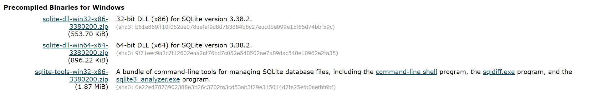

# sqlite

:::info

`SQLite`是一个软件库，实现了自给自足的、无服务器的、零配置的、事务性的 SQL 数据库引擎，是世界上最广泛部署的 SQL 数据库引擎，`SQLite`源代码不受版权限制

:::

## uniapp中安装

在uniapp项目`manifest.json`的`App模块配置`中勾选`sqlite`，HBuilderX中使用云打包时会在打包中安装`sqlite`

:::tip

sqlite可以存储140TB的数据量，所以不用担心sqlite存储满了，只需关注应用内存，若数据库内容过多，提示用户清理

:::

## 本地电脑安装

可以更方便地用于进行一些操作学习

-  [SQLite官网下载](http://www.sqlite.org/download.html)
- 根据电脑位数32或64选择下载第一个或第二个,第三个则是必须的，下载这两个压缩文件
- 创建文件夹 sqlite，在此文件夹下解压两个压缩文件，将得到 sqlite3.def、sqlite3.dll 和 sqlite3.exe 文件。
- 添加安装路径到PATH环境变量，最后在命令行中，使用`sqlite3`命令，即可进入sqlite3命令模式

## 完整语法

完整语法学习请看菜鸟教程[Sqlite教程](https://www.runoob.com/sqlite/sqlite-tutorial.html)

本笔记只记录一些常用的语法

## 创建或使用数据库

未进入sqlite3命令模式下，使用以下命令，打开数据库，不存在则创建并打开

```sh
sqlite3 DatabaseName.db
```

进入sqlite3命令模式下，使用以下命令，打开数据库，不存在则创建并打开

```sh
.open test.db
```

查看所有数据库列表

```sh
.databases
```

## 退出sqlite命令模式

以下三个命令都可以

```sh
.exit	
.quit	
ctrl+c
```

## 创建表

SQLite 的 `CREATE TABLE` 语句用于在任何给定的数据库创建一个新表。创建基本表，涉及到命名表、定义列及每一列的数据类型

```sh
CREATE TABLE database_name.table_name(
   column1 datatype  PRIMARY KEY(one or more columns),
   column2 datatype,
   column3 datatype,
   .....
   columnN datatype,
);
```

示例

```sh
CREATE TABLE test1(
   KEY  CHAR(100)     NOT NULL,
   VALUE   CHAR(100)   NOT NULL,
);
```

## CHAR和VARCHAR区别

char其实就是character，和varchar的区别在于：

1. 最大长度不同，char最大254bytes，而varchar最大32672bytes
2. char的存取速度要比varchar快得多，因为其长度固定，方便程序的存储与查找；但是char为此付出的是空间的代价，因为其长度固定，所以难免会有多余的空格占位符占据空间，可以说是以空间换取时间效率，而varchar则是以空间效率为首位的
3. char的存储方式是，一个英文字符（ASCII）占用1个字节，一个汉字占用两个字节；而varchar的存储方式是，一个英文字符占用2个字节，一个汉字也占用2个字节
4. char的长度是不可变的，而varchar的长度是可变的，char(n)在数据库占用n个字节，在数据库中以空格补足，取出来时末尾的空格将被去掉，varchar(n)在数据库中至少占用1个字节，在数据库中末尾的空格将自动去掉，实际占用录入数据长度 ＋1 或者 +2 字节 
   

## 列出数据库中所有表

```sh
.tables
```

## 删除表

SQLite 的 **DROP TABLE** 语句用来删除表定义及其所有相关数据、索引、触发器、约束和该表的权限规范

```sh
DROP TABLE database_name.table_name;
```

## 插入数据到表中

SQLite 的 **INSERT INTO** 语句用于向数据库的某个表中添加新的数据行

column1, column2, ...columnN 是要插入数据的表中的列的名称

value1, value2, ...valueN是要插入数据的表中的列的数据

```sh
INSERT INTO TABLE_NAME (column1, column2,...columnN)  
VALUES (value1, value2,...valueN);
```

如为表中的所有列添加值，可以不指定列名称，但要确保值的顺序与列在表中的顺序一致

```sh
INSERT INTO TABLE_NAME VALUES (value1,value2,value3,...valueN);
```


## 判断数据库是否打开

```js
 const isOpenDatabase = plus.sqlite.isOpenDatabase({
          name: 'first',
          path: '_doc/test.db',
        })
```

## 关闭数据库

```js
plus.sqlite.closeDatabase({
          name: 'first',
          success: () => {
            console.log("关闭数据库成功")
          },
          fail: () => {
            console.log("关闭数据库失败")
          }
        })
```

## sqlite.js

```js
module.exports = {
    dbName: 'check', // 数据库名称
    dbPath: '_doc/check.db', // 数据库地址
    // 判断数据库是否打开,打开返回true, 关闭返回 false
    isOpen() {
      return plus.sqlite.isOpenDatabase({
        name: this.dbName, // 数据库名称
        path: this.dbPath // 数据库地址
      })
    },
    // 创建或打开数据库
    openSqlite() {
      return new Promise((resolve, reject) => {
        plus.sqlite.openDatabase({
          name: this.dbName,
          path: this.dbPath,
          success(e) {
            resolve(e);
          },
          fail(e) {
            reject(e)
          }
        })
      })
    },
    // 关闭数据库
    closeSqlite() {
      return new Promise((resolve, reject) => {
        plus.sqlite.closeDatabase({
          name: this.dbName,
          success(e) {
            resolve(e)
          },
          fail(e) {
            reject(e)
          }
        })
      })
    },
    // 数据库建表 sql:'CREATE TABLE IF NOT EXISTS dbTable("id" varchar(50),"name" TEXT) 
    // 创建 CREATE TABLE IF NOT EXISTS 、 dbTable 是表名，不能用数字开头、括号里是表格的表头
    createTable(dbTable, data) {
      return new Promise((resolve, reject) => {
        // executeSql: 执行增删改等操作的SQL语句
        plus.sqlite.executeSql({
          name: this.dbName,
          sql: `CREATE TABLE IF NOT EXISTS ${dbTable}(${data})`,
          success(e) {
            resolve(e)
          },
          fail(e) {
            reject(e)
          }
        })
      })
    },
    // 数据库删表 sql:'DROP TABLE dbTable'
    dropTable(dbTable) {
      return new Promise((resolve, reject) => {
        plus.sqlite.executeSql({
          name: this.dbName,
          sql: `DROP TABLE ${dbTable}`,
          success(e) {
            resolve(e);
          },
          fail(e) {
            reject(e);
          }
        })
      })
    },
    // 向表格里添加数据 sql:'INSERT INTO dbTable VALUES('x','x','x')'   对应新增
    // 或者 sql:'INSERT INTO dbTable ('x','x','x') VALUES('x','x','x')'   具体新增
    // 插入 INSERT INTO  、 dbTable 是表名、根据表头列名插入列值
    insertTableData(dbTable, data, condition) {
      // 判断有没有传参
      if (dbTable !== undefined && data !== undefined) {
        // 判断传的参是否有值
        var bol = (JSON.stringify(data) == "{}");
        if (!bol) {
          if (condition == undefined) {
            var sql = `INSERT INTO ${dbTable} VALUES('${data}')`;
          } else {
            var sql = `INSERT INTO ${dbTable} (${condition}) VALUES(${data})`;
          }
          // console.log(sql);
          return new Promise((resolve, reject) => {
            // 表格添加数据
            plus.sqlite.executeSql({
              name: this.dbName,
              sql: sql,
              success(e) {
                resolve(e);
              },
              fail(e) {
                reject(e);
              }
            })
          })
        } else {
          return new Promise((resolve, reject) => {
            reject("错误添加")
          })
        }
      } else {
        return new Promise((resolve, reject) => {
          reject("错误添加")
        })
      }
    },

    // 根据条件向表格里添加数据  有数据更新、无数据插入
    // (建表时需要设置主键) 例如 --- "roomid" varchar(50) PRIMARY KEY
    insertOrReplaceData(dbTable, data, condition) {
      // 判断有没有传参
      if (dbTable !== undefined && data !== undefined) {
        if (condition == undefined) {
          var sql = `INSERT OR REPLACE INTO ${dbTable} VALUES('${data}')`;
        } else {
          var sql = `INSERT OR REPLACE INTO ${dbTable} (${condition}) VALUES(${data})`;
        }
        // console.log(sql);
        return new Promise((resolve, reject) => {
          // 表格添加数据
          plus.sqlite.executeSql({
            name: this.dbName,
            sql: sql,
            success(e) {
              resolve(e);
            },
            fail(e) {
              reject(e);
            }
          })
        })
      } else {
        return new Promise((resolve, reject) => {
          reject("错误添加")
        })
      }
    },

    // 查询获取数据库里的数据 sql:'SELECT * FROM dbTable WHERE lname = 'lvalue''
    // 查询 SELECT * FROM 、 dbTable 是表名、 WHERE 查找条件 lname,lvalue 是查询条件的列名和列值
    selectTableData(dbTable, lname, lvalue, cc, dd) {
      if (dbTable !== undefined) {
        // 第一个是表单名称，后两个参数是列表名，用来检索
        if (lname !== undefined && cc !== undefined) {
          // 两个检索条件
          var sql = `SELECT * FROM ${dbTable} WHERE ${lname} = '${lvalue}' AND ${cc} = '${dd}'`;
        }
        if (lname !== undefined && cc == undefined) {
          // 一个检索条件
          var sql = `SELECT * FROM ${dbTable} WHERE ${lname} = '${lvalue}'`;
          // console.log(sql);
        }
        if (lname == undefined) {
          var sql = `SELECT * FROM ${dbTable}`;
        }
        return new Promise((resolve, reject) => {
          // 表格查询数据  执行查询的SQL语句
          plus.sqlite.selectSql({
            name: this.dbName,
            sql: sql,
            success(e) {
              resolve(e);
            },
            fail(e) {
              reject(e);
            }
          })
        })
      } else {
        return new Promise((resolve, reject) => {
          reject("错误查询")
        });
      }
    },

    // 删除表里的数据 sql:'DELETE FROM dbTable WHERE lname = 'lvalue''
    // 删除 DELETE FROM 、 dbTable 是表名、 WHERE 查找条件 lname,lvalue 是查询条件的列名和列值
    deleteTableData(dbTable, lname, lvalue, ww, ee) {
      if (dbTable !== undefined) {
        if (lname == undefined) {
          var sql = `DELETE FROM ${dbTable}`;
        } else {
          if (ww !== undefined) {
            // 两个检索条件
            var sql = `DELETE FROM ${dbTable} WHERE ${lname} = '${lvalue}' AND ${ww} = '${ee}'`;
          } else {
            // 一个检索条件
            var sql = `DELETE FROM ${dbTable} WHERE ${lname} = '${lvalue}'`;
          }
        }
        return new Promise((resolve, reject) => {
          // 删除表数据
          plus.sqlite.executeSql({
            name: this.dbName,
            sql: sql,
            success(e) {
              resolve(e);
            },
            fail(e) {
              reject(e);
            }
          })
        })
      } else {
        return new Promise((resolve, reject) => {
          reject("错误删除")
        });
      }
    },

    // 修改数据表里的数据 sql:"UPDATE dbTable SET 列名 = '列值',列名 = '列值' WHERE lname = 'lvalue'"
    // 修改 UPDATE 、 dbTable 是表名, data: 要修改的列名=修改后列值, lname,lvalue 是查询条件的列名和列值
    updateTableData(dbTable, data, lname, lvalue) {
      if (lname == undefined) {
        var sql = `UPDATE ${dbTable} SET ${data}`;
      } else {
        var sql = `UPDATE ${dbTable} SET ${data} WHERE ${lname} = '${lvalue}'`;
      }
      // WHERE 前面是要修改的列名、列值，后面是条件的列名、列值
      return new Promise((resolve, reject) => {
        // 修改表数据
        plus.sqlite.executeSql({
          name: this.dbName,
          sql: sql,
          success(e) {
            resolve(e);
          },
          fail(e) {
            reject(e);
          }
        })
      })
    },

    // sql:"SELECT * FROM dbTable ORDER BY 'id' DESC LIMIT 15 OFFSET 'num'"
    // dbTable 表名, ORDER BY 代表排序默认正序, id 是排序的条件 DESC 代表倒序，从最后一条数据开始拿
    // LIMIT 15 OFFSET '${num}',这句的意思是跳过 num 条拿 15 条数据, num 为跳过多少条数据是动态值
    // 例 初始num设为0，就从最后的数据开始拿15条，下次不拿刚获取的数据，所以可以让num为15，这样就能一步一步的拿完所有的数据
    pullSQL(dbTable, id, num) {
      return new Promise((resolve, reject) => {
        plus.sqlite.selectSql({
          name: this.dbName,
          sql: `SELECT * FROM ${dbTable} ORDER BY '${id}' DESC LIMIT 15 OFFSET '${num}'`,
          success(e) {
            resolve(e);
          },
          fail(e) {
            reject(e);
          }
        })
      })
    }
```

