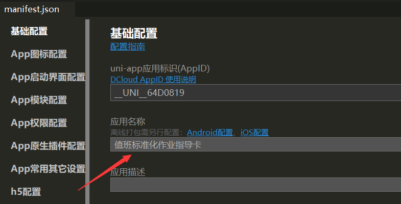

# 打包安卓

## 1.使用HBuilderX

选择HBuilderX右上角菜单栏->运行->原生App(云打包)

## 2.配置安卓证书

安卓应用发布需要证书，因为只是个人的项目，使用公共测试证书即可

如发布商店，请查看https://ask.dcloud.net.cn/article/35777

## 3.选择安心打包

点击右侧打包，在等待后会生成apk文件，发送apk文件至手机即可安装应用		

## 设置应用名

									

## 选择icon

打开项目manifest.json中App图标设置，选择图片路径然后点击`自动生成所有图标并替换`

## 设置支持64位架构

默认是32位架构

